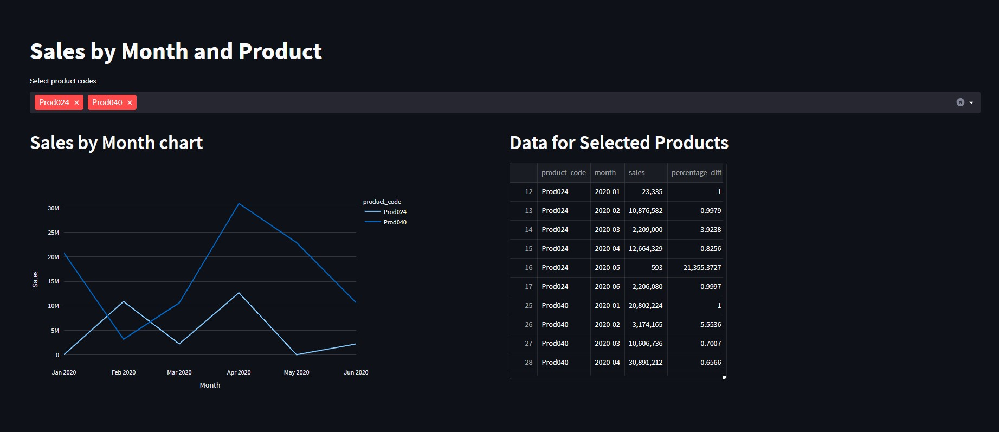

## Тестовое задание IDF Tech.

Данный репозиторий содержит решение для тестового задания на позицию Junior Data Engineer.

Решение представлено в виде докер контейнера для базы данных MySQL и сервиса-дашборда

### Запуск

Для запуска потребуется Docker:

1) В директории проекта (создаем .env файл)
   
        cat .env.tpl >> .env

2) В директории проекта (поднимаем контейнеры)
  
        docker compose up -d

P.S. Поднятие базы может занять немного больше времени, чем healthcheck, поэтому сразу же можно не получить отвтет от базы. Я проверяю это с помощью

    docker logs idf_test-db-1

и жду такого сообщения:

    2023-10-10T09:53:25.395578Z 1 [System] [MY-013576] [InnoDB] InnoDB initialization has started.
    2023-10-10T09:53:27.397424Z 1 [System] [MY-013577] [InnoDB] InnoDB initialization has ended.

## [Условие](./Data.Engineer.Test.task.IDF.pdf)

### Допущения

1. Revenue имеет одно и то же значение, что и total sales в контекте набора данных
2. Sales Amount - цена за 1 продукт
3. Sales Qty - количество проданных продуктов
4. Profit margin - профит от продажи 1 продукта
5. Profit margin percentage = profit margin / sale amount

## SQL

### Импорт данных

Импорт данных производится путем маунта дамп как файл инициализации БД (см. [docker-compose.yml](./docker-compose.yml))

### [2.1 Show total revenue in year 2020 in Chennai](./solution/sql/2.1-Chennai-2020-revenue.sql)

### [2.2 Show total revenue in year 2020, January Month](./solution/sql/2.2-January-2020-revenue.sql)

### [2.3 Show the most profitable markets_name and total sales_amount for them](./solution/sql/2.3-Profitable-markets.sql)

### [2.4 Show the customer who bought the most product Prod048](./solution/sql/2.4-Customer-most-bought%20copy.sql)

### [2.5 Show the average number of products sold per month](./solution/sql/2.5-Avg-product-number-sold.sql)

### [2.1 Show top 10 customers who have made the most purchases in 2017](./solution/sql/2.6-Top-10-customers-2017.sql)

## Dashboard

### Описание 

Изначально я искал легковесный образ BI инструмента и нашел Metabase (сервис есть в docker compose). У меня даже получилось вывести [необходимый результат](./solution/dashboard/Sales%20dashboard%20-%20metabase%20-%20couple%20values.pdf)

Далее я понял что экспортировать дашборд и карточки там не так просто (т.к. официальная фича доступна только в enterprise версии), поэтому решил привести решение на Python

В [docker-compose.yml](./docker-compose.yml) есть определение сервиса, а также собран Dockerfile для этого дашборда.

### Доступ

После поднятия контейнеров дашборда и базы, дашборд будет доступен по адресу

## localhost:8501

